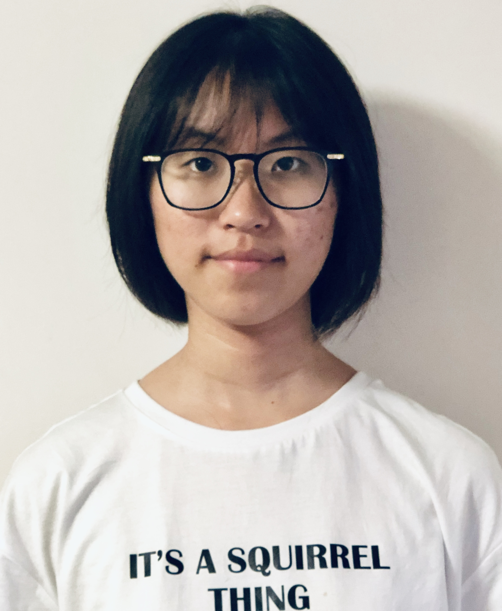

# Jingwen Liu
```
print("hello, welcome to my page!")
```
  
<!---
### my email: j9liu@ucsd.edu
### here is my [Github page](https://github.com/LJW0105)
### here is my [README](README.md)

If you want to jump to
- [Jingwen Liu](#jingwen-liu)
    - [my email: j9liu@ucsd.edu](#my-email-j9liuucsdedu)
    - [here is my Github page](#here-is-my-github-page)
    - [here is my README](#here-is-my-readme)
  - [Introduction](#introduction)
  - [CS Exprience](#cs-exprience)
  - [Goals](#goals)


## Introduction
I am a undergrad cs student at UC San Diego. I love watching movies and skiing. I really love eating *spicy* food!

My favorite **quote** is 
> Stay Hungry. Stay Foolish.

## CS Exprience
- programming languages
  1. Java
  2. Python
  3. C/C++
- machine learning/deep learning
  1. numpy
  2. pytorch  
  
## Goals
- [x] Find a ***lab*** in computer vision
- [ ] Find an ***internship*** of software programmer
- [ ] Finish an independent research ***project***
--->
